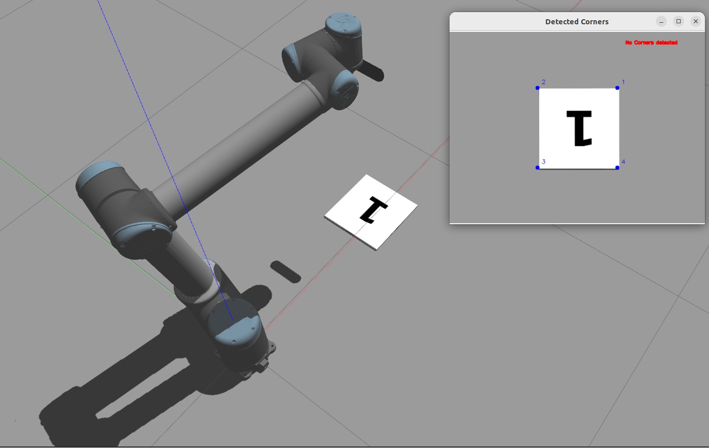

# IBVS - 基于图像的 UR10 视觉伺服系统

<p align="center">
  
</p>

<p align="center">
  
  
  
</p>

<p align="center">
  <b>中文</b> | <a href="README.md">English</a>
</p>

---

### 项目简介

本项目是一个基于 **ROS2 Humble** 的**眼在手上（Eye-in-Hand）图像视觉伺服（IBVS）**系统，用于在 **Gazebo** 仿真环境中控制 **Universal Robots UR10** 六自由度机械臂。

系统在机械臂末端安装 Intel RealSense D455 深度相机，通过检测相机图像中矩形目标的四个角点，计算当前特征与期望特征之间的误差，利用 ViSP 视觉伺服库生成相机速度指令，再经由 TF2 坐标变换和雅可比伪逆运算转换为关节速度，最终发送给 ros2 速度控制器，驱动机械臂运动，使目标角点逐步收敛到图像中的期望位置。

### 系统架构

```
                  Gazebo 仿真环境
                  ┌──────────────────────────────────────────────┐
                  │   UR10 机械臂 + D455 相机 + 目标物体        │
                  └────┬──────────┬──────────────┬──────────────┘
                       │          │              │
            /rgb/image_raw  /joint_states  /rgb/camera_info
                       │          │              │
                       ▼          │              │
              ┌────────────────┐  │              │
              │   ibvs_node    │◄─┘              │
              │                │◄────────────────┘
              │  · 角点检测 (OpenCV)              │
              │  · 视觉伺服 (ViSP)               │
              │  · 相机→基座速度 (TF2)           │
              │  · 基座→关节速度 (雅可比伪逆)    │
              └───────┬────────┘  ▲
                      │           │
 /ur_joint_velocity   │   /jacobian_matrix (6×6)
 _controller/commands │           │
                      │    ┌──────┴────────┐
                      │    │   ik_node     │
                      │    │               │
                      │    │  · Pinocchio  │
                      │    │    正运动学   │
                      │    │  · 雅可比计算 │
                      │    │  · 末端位置   │
                      │    └───────────────┘
                      ▼
            ┌─────────────────────┐
            │   ros2_control      │
            │  (速度控制器)       │
            └─────────────────────┘
```

**数据流说明：**

1. Gazebo 发布仿真相机图像和关节状态
2. `ibvs_node` 接收 RGB 图像，通过 OpenCV（Canny 边缘检测 + 轮廓查找 + 多边形近似）检测矩形角点，并利用相机内参转换为 ViSP 特征点
3. `ibvs_node` 计算当前角点与目标位置（图像中心附近 4 个角点）之间的视觉误差，若 RMSE > 0.01，ViSP 计算 6-DOF 相机速度指令
4. TF2 获取 `kinect_link` 到 `base_link` 的坐标变换，将相机坐标系速度转换为基座坐标系速度
5. `ik_node` 持续通过 Pinocchio 计算并发布 6×6 雅可比矩阵（30Hz）
6. `ibvs_node` 利用雅可比伪逆将基座坐标系速度转换为 6 个关节速度
7. 关节速度发布到 `/ur_joint_velocity_controller/commands`

### 功能特性

- **矩形角点检测** — 基于 OpenCV 的 Canny 边缘检测与轮廓分析，自动识别矩形目标的四个角点并按顺时针排序
- **视觉伺服控制** — 利用 ViSP 库实现经典的 Eye-in-Hand IBVS 控制律（λ=0.3）
- **实时雅可比计算** — 基于 Pinocchio 动力学库，从 URDF 加载机器人模型，实时计算 6×6 雅可比矩阵
- **坐标变换** — 通过 TF2 实现相机坐标系到基座坐标系的速度变换
- **实验数据记录** — 自动将特征误差和关节速度记录为 CSV 文件，便于离线分析
- **收敛判定** — 当特征误差 RMSE 降至 0.01 以下时，自动停止伺服

### 依赖环境

| 类别 | 依赖 |
|------|------|
| **ROS2** | ROS2 Humble、rclcpp、std_msgs、sensor_msgs、geometry_msgs、cv_bridge、tf2_ros、image_transport、controller_manager |
| **仿真** | Gazebo、gazebo_ros2_control、robot_state_publisher、xacro |
| **C++ 库** | OpenCV、ViSP（Visual Servoing Platform）、Eigen3、Pinocchio |

### 安装与编译

**1. 安装 ROS2 Humble**

参考 [ROS2 官方文档](https://docs.ros.org/en/humble/Installation.html)。

**2. 安装外部依赖**

```bash
# OpenCV（ROS2 通常已自带）
sudo apt install libopencv-dev

# ViSP — 参考官网安装指南：https://visp.inria.fr/install/

# Eigen3
sudo apt install libeigen3-dev

# Pinocchio — 参考官网安装指南：https://stack-of-tasks.github.io/pinocchio/download.html
```

**3. 编译工作空间**

```bash
cd ~/ws_demo2
colcon build
source install/setup.bash
```

### 运行方法

**启动完整仿真系统：**

```bash
ros2 launch ibvs ur10_gazebo.launch.py
```

该命令将依次启动：
1. Gazebo 仿真环境（含 UR10 机械臂和目标物体）
2. `robot_state_publisher`（发布机器人 TF）
3. `ros2_control_node`（控制器管理器）
4. `joint_state_broadcaster`（关节状态广播器）
5. `ur_joint_velocity_controller`（速度控制器）
6. `ibvs_node`（视觉伺服节点）
7. `ik_node`（雅可比计算节点）

**启用调试相机视图（可选）：**

在 `src/ibvs/launch/ur10_gazebo.launch.py` 中取消 `camera_image_node` 的注释即可启用 OpenCV 图像显示窗口。

### 包结构说明

```
src/
├── ibvs/                           # 核心视觉伺服包
│   ├── include/ibvs.h              # VisualServoInit 类声明
│   ├── src/ibvs.cpp                # 视觉伺服完整实现 (~712 行)
│   ├── launch/ur10_gazebo.launch.py # 系统启动文件
│   └── data/                       # CSV 实验数据
│       ├── error_data/             # 特征误差记录
│       └── joint_vel_data/         # 关节速度记录
│
├── ik/                             # 雅可比计算包
│   ├── include/ik.h                # IKNode 类声明
│   ├── src/ik.cpp                  # Pinocchio 雅可比实现 (~246 行)
│   └── src/ik_test.cpp             # 独立测试程序
│
├── ur_description/                 # UR10 机器人描述包
│   ├── urdf/ur10.urdf.xacro        # UR10 + D455 相机 URDF
│   ├── config/ur10_gazebo_controllers.yaml # 控制器配置
│   ├── worlds/gazebo_world.world   # Gazebo 仿真世界
│   └── meshes/ur10/                # 3D 模型文件 (DAE/STL)
│
└── camera_image/                   # 相机图像调试工具
    └── src/camera_image.cpp        # OpenCV 图像显示节点
```

### ROS2 话题与控制器

**订阅的话题：**

| 话题 | 消息类型 | 说明 |
|------|----------|------|
| `/rgb/image_raw` | `sensor_msgs/Image` | RGB 相机图像 |
| `/depth/image_raw` | `sensor_msgs/Image` | 深度图像（暂未使用） |
| `/rgb/camera_info` | `sensor_msgs/CameraInfo` | 相机内参 |
| `/joint_states` | `sensor_msgs/JointState` | 关节状态 |
| `/jacobian_matrix` | `std_msgs/Float64MultiArray` | 6×6 雅可比矩阵（36 元素） |

**发布的话题：**

| 话题 | 消息类型 | 说明 |
|------|----------|------|
| `/ur_joint_velocity_controller/commands` | `std_msgs/Float64MultiArray` | 6 个关节速度指令 |

**控制器配置：**

- `ur_joint_velocity_controller` — `velocity_controllers/JointGroupVelocityController`，控制 UR10 全部 6 个关节
- `joint_state_broadcaster` — `joint_state_broadcaster/JointStateBroadcaster`

### 参数与配置

| 参数 | 值 | 说明 |
|------|-----|------|
| 伺服增益 λ | 0.3 | ViSP 视觉伺服控制律增益 |
| 收敛阈值 | RMSE < 0.01 | 归一化图像坐标下的特征误差 |
| 相机分辨率 | 640 × 480 | D455 仿真相机分辨率 |
| 相机帧率 | 30 Hz | Gazebo 仿真相机发布频率 |
| 雅可比发布频率 | 30 Hz | ik_node 计算发布频率 |
| 目标角点 | (320±100, 240±100) | 图像中心附近 4 个期望角点（像素坐标） |

### 实验数据

系统运行时自动在 `src/ibvs/data/` 目录下生成 CSV 文件：

- **`error_data/`** — 记录每帧的特征误差和 RMSE
- **`joint_vel_data/`** — 记录每帧的 6 个关节速度指令

文件命名格式：`{类型}_{MMDD}_{HHmmss}.csv`

### 致谢

- [ViSP](https://visp.inria.fr/) — Visual Servoing Platform
- [Pinocchio](https://stack-of-tasks.github.io/pinocchio/) — 刚体动力学库
- [Universal Robots ROS2 Driver](https://github.com/UniversalRobots/Universal_Robots_ROS2_Driver) — UR10 模型参考

### 许可证

本项目采用 MIT 许可证。
